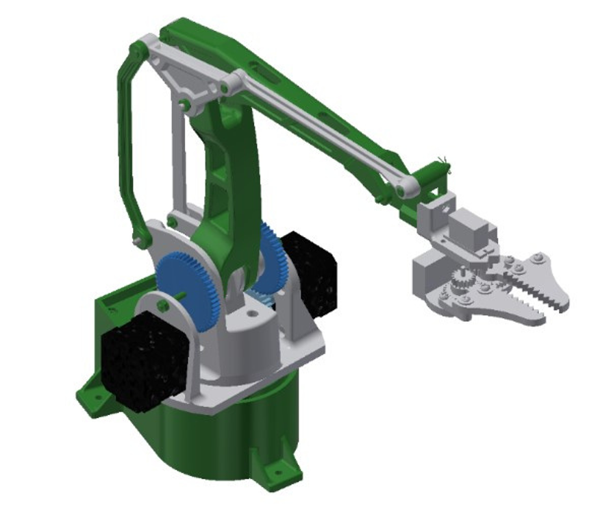
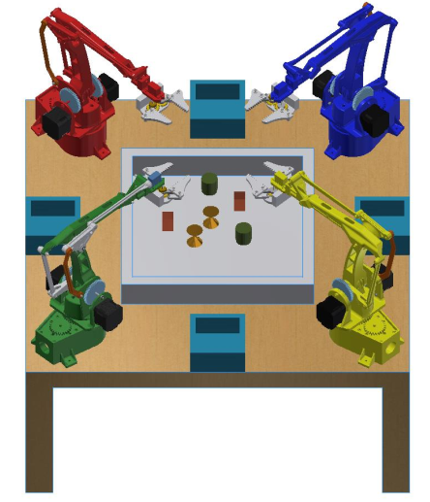
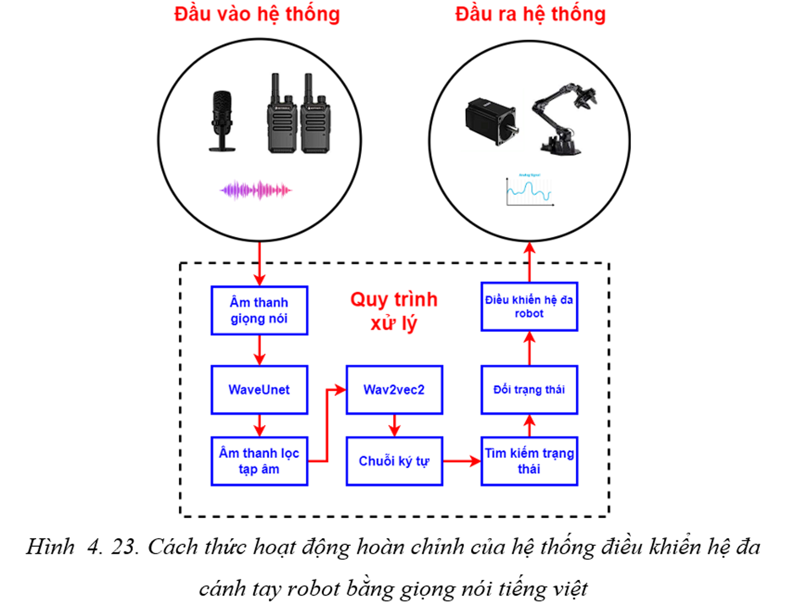

# Điều khiển hệ đa cánh tay robot công nghiệp bằng giọng nói tiếng Việt

### Mô hình cánh tay cánh tay robot công nghiệp

### Ý tưởng hệ thống 
Tận dụng hai mô hình trí tuệ nhân tạo:
1. [WaveUnet](https://github.com/f90/Wave-U-Net) để xử lý lọc âm thanh nhiễu trong âm thanh chứa giọng nói.
2. [Wav2vec2-base-vietnamese-250h](https://github.com/nguyenvulebinh/vietnamese-wav2vec2) để xử lý nhận diện giọng nói.

Sau đó tạo tín hiệu điều khiển cho các cánh tay robot công nghiệp. 

### Nội dung: 
1. Đây là mã nguồn cho đề tài nghiên cứu khoa học năm 2024 của Học viện kỹ thuật Quân Sự. 

2. Tên của đề tài "Thiết kế, chế tạo và điều khiển hệ đa cánh tay robot công nghiệp ứng dụng trí tuệ nhân tạo và kỹ thuật nhận diện giọng nói".

### Lời cảm ơn
* Cảm ơn PSG. TS Dương Xuân Biên đã hổ trợ nhóm làm các vấn đề nội dung nghiên cứu khoa học này.
* Cảm ơn các em Phùng Tiến Đạt và Hà Thành Đạt đã hổ trợ lắp ghép cơ điện, xây dựng hệ thống. 

## Liên hệ
1. Tác giả : Phạm Hoàng Nam
3. Gmail : phn1712002@gmail.com 

